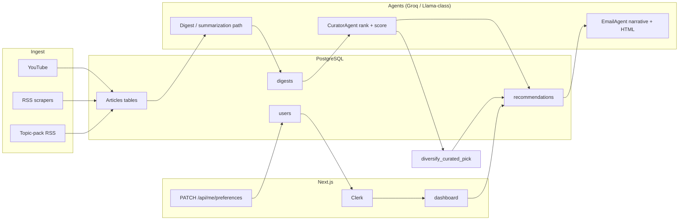

# Helix / News-aggregator — Interview & Architecture Guide

**Purpose.** This artifact is meant for **you**, the candidate: a single map of how the system works plus **anticipated interview prompts** so you can answer crisply—not marketing copy.

**Names in the codebase.** README still says “AI News Curator”; the **web UI** presents **Helix**. Same product: ingestion → digests → LLM ranking → email + dashboard.

---

## Contents

1. [Elevator pitches](#elevator-pitches)
2. [Problem & solution framing](#problem--solution-framing)
3. [End-to-end diagram](#end-to-end-architecture-mermaid)
4. [Daily pipeline timeline](#daily-pipeline-what-runs-each-night-or-on-demand)
5. [Glossary](#glossary-ingest-vs-digest-vs-recommendation)
6. [Topic bundles & ingestion](#topic-bundles--ingestion-registry)
7. [Personalization & diversification](#personalization-curator--topic-diversification)
8. [Data storage & dual access](#postgresql--sqlalchemy-vs-prisma)
9. [Web app (Next.js)](#nextjs-dashboard--preferences--auth)
10. [Operational entrypoints](#operational-entrypoints-docker-cron-fastapi-github-actions)
11. [Security & privacy talking points](#security--privacy-points-to-mention)
12. [Limitations & honest tradeoffs](#limitations--honest-tradeoffs)
13. [Interview cheat sheet (Q&A)](#interview-cheat-sheet-organized-by-theme)

---

## Elevator pitches

### ~30 seconds

> “Helix runs a nightly **Python pipeline** that pulls **RSS, lab blogs, YouTube-derived content**, summarizes it into **`digests`** in Postgres, then uses a **Groq-hosted LLM** as a **curator** to rank stories per user profile. Personalized picks land as **`recommendations`** and outbound **email**. A **Next.js** dashboard (Clerk auth) edits **topic bundles**, shows the curated feed, and matches the backend’s diversification rules.”

### ~2 minutes

> “It’s split into **three layers**. **Ingest**: modular scrapers (YouTube, OpenAI/Anthropic pages, TechCrunch, The Verge) plus configurable BBC/Guardian-style **topic-pack RSS**. **Process**: summarize into **`digests`** with stable IDs. **Intel**: `CuratorAgent` compares unseen digests to a JSON **`user_profile`** (topic bundles + interests) and emits scores and reasoning. Before we take Top-N, **`diversify_curated_pick`** **round-robins** across subscribed bundles so one lane doesn’t dominate when users enable multiple bundles. Delivery is SMTP email and the Prisma-backed dashboard. Cron can run **`python -m app.daily_runner`**; optionally FastAPI **`/run-digest`** hits the same pipeline.”

---

## Problem / solution framing

| Pain | Helix angle |
|------|--------------|
| High noise in feeds | Summarization (`DigestAgent` / digest pipeline) + ranking |
| One-size summaries | **`user_preferences`** JSON (bundles + interests) gates and steers curator |
| Silo fixation (only tech OR only politics) | **Bundles** + **diversification** when ≥2 bundles |
| Cost of hosted LLMs | Groq Llama-class models for speed/cost envelope |
| Trust & audit trail | Persist **scores**, **reasoning**, **rank**, **`article_type`** for UX lanes |

---

## End-to-end architecture (Mermaid)

*(Flow is illustrative: exact function names vary by caller; email path also uses curator + diversify in batch digest generation.)*

---

## Daily pipeline: what runs each night (or on-demand)

Canonical orchestration: **`app/daily_runner.py`** → **`run_daily_pipeline`**. Invocation:

| How | Notes |
|-----|-------|
| `uv run main.py [hours] [top_n]` | Root `main.py` delegates here |
| `python -m app.daily_runner` | GitHub Action `daily_digest.yml` pattern |
| FastAPI `/run-digest` | `app/main.py` fires pipeline in background; optional **`CRON_SECRET`** header |

**Typical staged work** (conceptual order—read `daily_runner.py` for authoritative steps):

1. **DB housekeeping** — e.g. ensure columns used by thumbnails / migrations helpers.
2. **Scrapers** — `runner.run_scrapers` / registry includes core sources + **`RSS_TOPIC_FEED_SCRAPERS`** from `app/topic_packs/registry.py`.
3. **Downstream processors** — e.g. Anthropic markdown ingestion, transcript processing, **`process_digests`** style consolidation into **`digests`** table.
4. **Per-user personalization** — load user → build profile → filter digests **`digest_matches_topics`** → **`CuratorAgent.rank_digests`** → **`diversify_curated_pick`** → persist **`recommendations`**, personalized email sends, trial/warning bookkeeping.
5. **Rate limiting / sleeps** — e.g. between Groq-heavy calls where configured.

---

## Glossary (ingest vs digest vs recommendation)

| Term | Meaning |
|------|---------|
| **Article / raw row** | Row in e.g. `youtube_videos`, `openai_articles`, `general_rss_articles` depending on scraper |
| **`digest`** | **Unified product artifact**: summarized story with **`id`**, **`title`**, **`summary`**, **`url`**, **`article_type`** (feeds UX “lane” mapping), timestamps |
| **`recommendation`** | **User-specific**: links **`user_id`**, **`digest_id`**, curator **`relevance_score`**, **`rank`**, **`reasoning`** |
| **Topic bundle** | One of `technology`, `politics`, `sports`, `cricket` — subscribed in `preferences.topics` (JSON inside `users.preferences`) |
| **`article_type`** | String discriminator (e.g. `youtube`, `topic_pol_bbcpolitics`) used to infer bundle for filtering + diversity |

---

## Topic bundles / ingestion registry

File: **`app/topic_packs/registry.py`**

- **`ALLOWED_TOPIC_IDS`** — canonical four bundles; Python and **`web/src/lib/topics.ts`** should stay aligned.
- **`TECH_ARTICLE_SOURCES`** — digest `article_type` values grouped as **technology** (YouTube/OpenAI labs/tech pubs).
- **`RSS_TOPIC_FEED_SCRAPERS`** — maps registry scraper names → **`topic_id`** + BBC/Guardian RSS URLs; stored via configurable RSS scraper (`app/scrapers/configurable_rss.py`) under distinct **`source`** / digest types (e.g. `topic_pol_bbcpolitics`).

Helper mental model:

- **`_topic_from_article_type`** — string → canonical bundle key or unknown.
- **`digest_matches_topics`** — if type maps to a known bundle and user lacks that bundle, digest is skipped for personalization; **unknown types stay eligible** by design (“don’t silently empty funnel” on legacy rows).
- **`normalize_user_topics`** — parse JSON preferences; fallback from interests heuristics; default **full four bundles** when nothing valid.

Runner wiring: **`app/runner.py`** builds **`SCRAPER_REGISTRY`** including topic-pack rows derived from **`_topic_pack_scraper_rows()`**.

---

## Personalization: curator & topic diversification

### Curator

File: **`app/agent/curator_agent.py`** (extends **`app/agent/base.py`** Groq OpenAI-compatible client.)

- Builds a prompt from **subscriber topic bundle labels**, **keywords**, **expertise**, **profile notes**.
- Asks model for structured JSON: **`digest_id`**, **relevance score**, **rank**, **reasoning**.
- **Critical correctness constraint** in prompts: **`digest_id` must match ingestion IDs verbatim** — avoids orphaned joins.

### Diversification

File: **`app/topic_packs/diversify.py`** — **`diversify_curated_pick`**

Behavior to explain in interviews:

1. Sort curator output by **`rank`**.
2. If user has **fewer than 2 bundles**, diversification is **no-op**: take global curator order, **Top-N**.
3. If **≥ 2 bundles**: bucket picks by inferred lane (`_topic_from_article_type`).
4. **Round-robin** across subscribed lanes (deque per lane + “misc” overflow).
5. If lanes exhaust before **N**, **backfill** in original curator global order **without duplicates**.

Used in **`daily_runner`**, **`app/services/process_email.py`** (`generate_email_digest`), and **`send_test_digest_with_images.py`**.

---

## PostgreSQL — SQLAlchemy vs Prisma

**Same Postgres instance**, two ORM layers:

| Layer | Path | Used by |
|-------|------|---------|
| **SQLAlchemy** | `app/database/models.py`, `repository.py` | Python pipeline, agents, email |
| **Prisma** | `web/prisma/schema.prisma` | Next.js server components & API routes |

**Gotcha to own in interviews:** schema drift risk. Example: Prisma **`User`** includes optional **`clerk_id`**; SQLAlchemy **`User`** model in `models.py` does **not** define it—web often keys **`id`** to Clerk user id on first dashboard hit for alignment with pipeline.

**Key tables:** `digests`, `users`, `recommendations`, `pipeline_runs` (operational visibility), article source tables.

---

## Next.js dashboard / preferences / auth

| Piece | Path | Role |
|-------|------|------|
| **Middleware** | `web/src/middleware.ts` | Clerk; public home + auth + webhooks |
| **Dashboard** | `web/src/app/dashboard/page.tsx` | Creates/syncs user, topic picker, feed, lane stats, **`BriefingRevealOverlay`** |
| **Preferences API** | `web/src/app/api/me/preferences/route.ts` | Auth’d **PATCH**; **`canonicalTopicSelection`** for `topics` |
| **Clerk webhook** | `web/src/app/api/webhooks/clerk/route.ts` | `user.created` → Prisma user + default topics |
| **Pipeline status** | `web/src/app/api/pipeline/status/route.ts` | Latest run for admin UI |
| **Topic UX** | `web/src/lib/topics.ts`, `TopicBundlePicker.tsx`, `digest-topic.ts` | Bundle labels + digest→lane chrome |

**Briefing reveal:** first dashboard session + **once per local calendar day** (`localStorage` keys `helix_briefing_intro_done`, `helix_briefing_last_daily_ymd`); respects **`prefers-reduced-motion`**.

---

## Operational entrypoints (Docker, Cron, FastAPI, GitHub Actions)

| Surface | Location | Notes |
|---------|----------|------|
| **Docker default command** | `Dockerfile` | Runs **root** `main.py` → **daily pipeline**, not FastAPI |
| **FastAPI** | `app/main.py` | Health / trigger / optional `PipelineRun` status |
| **GitHub Actions** | `.github/workflows/daily_digest.yml` | Scheduled digest run; secrets for DB, Groq, SMTP, etc. |
| **Instagram** | `.github/workflows/instagram_post.yml` | Separate social surface from core digest read path |
| **Utility script** | `scripts/set_user_topics.py` | Ops: set `preferences.topics` by email |

---

## Security / privacy (points to mention)

- **Clerk** handles identity; **webhook** verified with **Svix** signatures (`WEBHOOK_SECRET`).
- **Cron / pipeline trigger** can require **`CRON_SECRET`** on HTTP trigger (see `app/main.py`).
- **Secrets** live in env / GitHub Secrets—never commit `.env`.
- **User content** is links + summaries; treat **PII** (email, name) as normal app data with retention policy you can discuss at employer level.
- **RSS & third-party terms** — operational compliance is on you as operator (rate limits, attribution).

---

## Limitations / honest tradeoffs

| Topic | Straight answer |
|-------|-----------------|
| **Dual ORM** | Faster shipping for Next + Python; needs discipline on migrations |
| **LLM brittleness** | Mitigated by JSON schema, retries (`tenacity` in base agent), ID-matching rules |
| **Single DB** | Bottleneck for very large scale; horizontal read replicas would be next step |
| **No vector DB in core path** | Ranking is **profile + full digest list** per batch, not embedding RAG over a corpus |
| **Topic mapping** | New sources need explicit **`article_type` → bundle** mapping for best filtering |
| **Email deliverability** | SMTP app passwords / provider limits are real ops work |

---

## Interview cheat sheet (organized by theme)

### A. “Walk me through the system.”

**Answer skeleton:** Ingest → raw tables → digest summarization → unified `digests` → per user load profile + filter by bundles → LLM curator ranks → diversify across bundles if multi-lane → save `recommendations` + email → dashboard reads same DB via Prisma.

### B. “Why two ORMs?”

**Answer:** Python pipeline predates or runs separately from the Next dashboard; Prisma gives type-safe access in TS. Tradeoff is **double schema maintenance**—I’d consolidate on one migration source of truth or codegen if the team grew.

### C. “How do you personalize?”

**Answer:** JSON **`preferences`** on `users` with **`topics`** array (bundles) plus **`interests`** / keywords. Curator prompt includes bundle labels and keyword list. Pre-filter with **`digest_matches_topics`** so irrelevant lanes never hit the model for that user.

### D. “What if the user subscribes to everything?”

**Answer:** Curator still orders globally, but **`diversify_curated_pick`** **interleaves** picks across lanes so the top of the list isn’t dominated by whatever scored highest in one category.

### E. “Why Groq / Llama vs OpenAI?”

**Answer:** Throughput and cost envelope for **batch nightly scoring**; structured JSON outputs; project historically migrated off pricier APIs (README story). You can add “we’d re-benchmark for quality if we went enterprise.”

### F. “How do you test the pipeline?”

**Answer:** `send_test_digest_with_images.py` path; dry runs with limited `hours`/`top_n`; inspection of `recommendations` row; optional manual FastAPI trigger with secret.

### G. “What happens on first sign-in?”

**Answer:** Clerk session; dashboard creates or loads Prisma user; webhook path also seeds defaults; **BriefingRevealOverlay** uses localStorage for first-time + daily animation; preferences default to **all bundles** for maximum mix when empty.

### H. “How do you handle duplicate or bad RSS items?”

**Answer:** Articles keyed by GUID/primary keys in source tables; digest construction layer defines how deduping/summarization happens—point interviewer to **`process_digest.py`** and digest agent for specifics.

### I. “Scale to 1M users?”

**Answer:** Batch per user is O(users × model calls). Sharding strategies: queue (Celery/SQS), **batch multiple users** only if privacy allows, **cache digests** globally then score in parallel, **regional read replicas**, **move LLM to dedicated pool** with rate limits.

### J. “Security of webhooks?”

**Answer:** Svix signature verification; reject missing headers; return 200 on downstream email failure if platform requires (Clerk pattern—see implementation).

### K. “What would you improve next?”

**Answer:** Single migration pipeline; observability (OpenTelemetry); explicit **dead-letter** queue for failed digest rows; A/B test prompts; user-level **embedding** for long-term interest drift; **admin** topic editor without redeploy.

### L. “Frontend state vs server?”

**Answer:** Dashboard is **RSC-heavy** with server fetch of recommendations; **TopicBundlePicker** is client for interactivity; **BriefingReveal** is client-only for animation + `localStorage`.

### M. “ID alignment between curator and DB?”

**Answer:** Prompts explicitly require **`digest_id`** copy-paste from listing; malformed IDs would break joins—so it’s a **product + prompt + validation** concern.

### N. “What is `article_type`?”

**Answer:** Provenance / lane key: ties a digest back to scraper source and drives **`digestLaneFromArticleType`** in the web UI and **`_topic_from_article_type`** in Python.

### O. “CI/CD?”

**Answer:** GitHub Actions for scheduled digest; Docker publish workflow; env secrets for production parity with local `.env`.

---

## File index (quick navigation)

| Concern | File(s) |
|---------|---------|
| Daily orchestration | `app/daily_runner.py`, root `main.py` |
| Scraper registry | `app/runner.py` |
| Topic registry | `app/topic_packs/registry.py` |
| Diversify | `app/topic_packs/diversify.py` |
| Curator | `app/agent/curator_agent.py` |
| Email generation | `app/agent/email_agent.py`, `app/services/process_email.py`, `app/services/email_sender.py` |
| User profile shape | `app/profiles/user_profile.py`, `app/services/user_service.py` |
| SQLAlchemy models | `app/database/models.py` |
| Prisma schema | `web/prisma/schema.prisma` |
| Preferences API | `web/src/app/api/me/preferences/route.ts` |
| Dashboard UI | `web/src/app/dashboard/page.tsx` |
| Briefing animation | `web/src/components/BriefingRevealOverlay.tsx`, `web/src/app/globals.css` |

---

## Closing line for interviews

> “It’s a **batch personalization engine**: deterministic ingestion and storage, **LLM for judgment** where humans don’t scale, and **explicit product rules** (bundles + diversification) so the output feels like a **balanced briefing**, not a single-topic firehose.”

Good luck.
